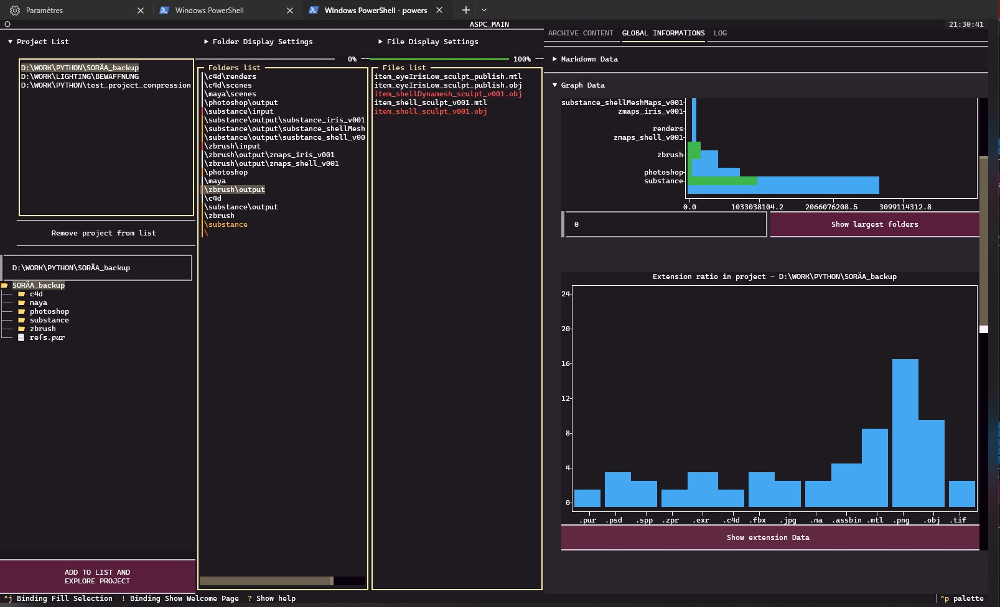

# ASPC - AUSPICIOUS
*Writen by Delaporte Robin AKA Quazar*

## Example videos
[Example video 1](images/video_demo_ASPCSnoop.mp4)

> [!NOTE] *The project was writen using python 3.13.1*

## Introduction
**AUSPICIOUS** is a Python application designed to help you optimize and clean up your  
old **projects** (large folder/file hierarchies).  
> This program was primarily designed with 3D projects / visual creations in mind,  
> which can generate a very large number of potentially heavy files.

**AUSPICIOUS** allows you to:
- scan your projects to collect a wide range of information about each item inside
- filter through the content to identify files that are large, repetitive (auto-saves, image sequences...), or not used for a long time
- visualize information related to your project’s content (via dataset insights, graphs, etc.)
- archive filtered or selected items into a compressed file (which you can access through the ASPC interface)

> [!IMPORTANT] You can read the documentation here : *[ASPC Documentation on Notion](https://scythe-hugger-9ae.notion.site/AUSPICIOUS-DOCUMENTATION-204f29fde0e380778293fa739104ce75?source=copy_link)*

> **I hope you will like this project, don't hesitate to star the repository, report your bugs (since it's a first release).**
> **You can also tell me about new features ideas, I'm still thinking about how to improve the project but I'm open to suggestions :)**
> **Enjoy**

## NEXT FEATURES IDEAS
- [ ] Improve the Overhead detection / fix system (during archiving and after)
- [ ] Add statistics features (largest items list)
- [ ] Create the Obsolescence Detection System in order to target precisely which files should be archived (size, repeatability, last modification date...)
- [ ] Create the asset manager (for live AND archived items)

